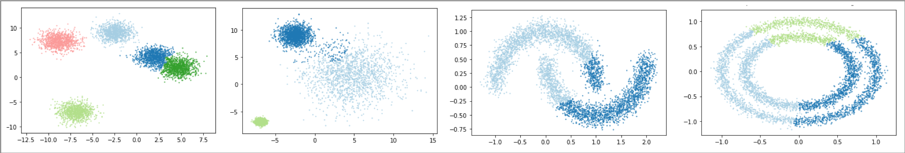

FINCH Clustering Algorithm
=====
__First Integer Neighbor Clustering Hierarchy Algorithm__

<p align="center">
    
</p>

A Python implementation of FINCH algorithm from the paper
> Sarfraz, Saquib, Vivek Sharma, and Rainer Stiefelhagen. "Efficient parameter-free clustering using first neighbor relations." Proceedings of the IEEE/CVF Conference on Computer Vision and Pattern Recognition. 2019.

This implementation is faster than the original implementation (see benchmark below). Further, our code deviates from the paper as it does not implement Algorithm 2, "Required Number of Clusters Mode".

---

## Installation

The easiest way to install *finchpy* is by using `pip` :

    pip install finchpy

## How to use

```python
from finch import FINCH

fin = finch()
fin.fit(data)

print(fin.partitions)
```

- __Demo Notebook:__ the following noteboook shows a demo of common features in this package - [see Jupyter Notebook](/demo/demo.ipynb)

### Class Parameters

```
--metric        string      The used distance metric        Default='euclidean'
--n_jobs        int         The number of processes         Default=1
```

### Methods

* `fit(X)`: Apply the FINCH algorithm.
* `fit_predict(X)`: Apply the FINCH algorithm and returns a reasonable partitioning labels based on the silhouette coefficient.

---

### Benchmark

Here is a comparison of the performance of the finchpy implementation to the original ssarfraz Python implementation:

```md
Hardware: Intel(R) Core(TM) i7-6567U CPU @ 3.30GHz with 16 GB RAM
Computed with %timeit with 2 run and 5 loops, and for memory %memit

| Samples| ssarfraz CPU | ssarfraz RAM | finchpy CPU | finchpy RAM | 
|------- |------------- |------------- |------------ |-------------|
| 1000   | 32.4 ms      | 109.63 MiB   | 29.3 ms     | 93.02 MiB   |
| 10000  | 1.62 s       | 689.86 MiB   | 215 ms      | 95.99 MiB   |
| 20000  | 7.57 s       | 2069.90 MiB  | 443 ms      | 101.78 MiB  |
| 50000  | -----        | -----        | 1.4 s       | 115.35 MiB  |
| 75000  | -----        | -----        | 2.56 s      | 129.67 MiB  |

pyflann was not used for the ssarfraz code as it does not support Python 3
```

---

## License

Released under MIT License. See the [LICENSE](LICENSE) file for details. The package was developed by Eren Cakmak from the [Data Analysis and Visualization Group](https://www.vis.uni-konstanz.de/) Konstanz, Germany. This work is partly funded by the Deutsche Forschungsgemeinschaft (DFG, German Research Foundation) under Germany's Excellence Strategy – EXC 2117 – 422037984“
